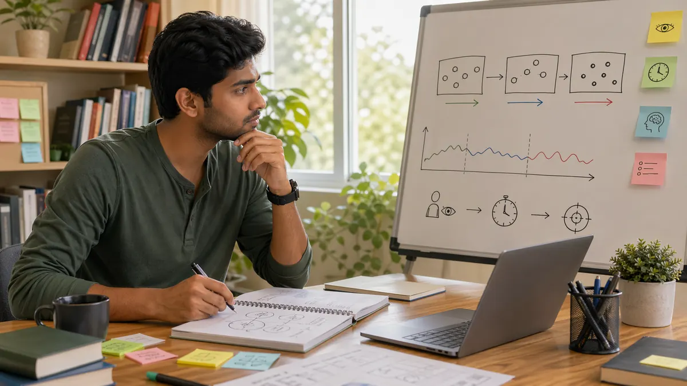

# Skill Gaming Game Awareness: How to Read More Than Your Own Plan

## 🪶 Introduction

Skill gaming game awareness matters because many players are not really losing to complexity. They are losing to tunnel vision. They see their own idea clearly, but they miss pace changes, opponent adjustments, and the subtle signals that the position is no longer what it was one turn ago.

This article explains game awareness through realistic session review: why awareness changes decision quality, what players tend to miss in real time, how false certainty grows when awareness drops, and how to train broader attention without becoming overwhelmed.

---

## 🖼️ Game Awareness Overview

---

## 🎯 What Is Game Awareness?

Game awareness is the habit of reading the whole situation instead of only the move you want to make. It includes table rhythm, opponent behavior, position changes, pressure levels, and the difference between what is visible and what you are assuming.

Awareness matters because the same action can be strong or weak depending on what else is happening around it.

---

# 🧠 1. Awareness Begins With Context, Not Instinct

Players often talk about awareness as if it were a natural feel for the game. In practice, awareness improves when you learn to track context deliberately. What changed in pace? Who is uncomfortable? Which line is becoming more likely? Those are trained questions.

This matters because instinct without structure can become guesswork. Strong awareness usually looks intuitive from the outside, but it is built from repeated observation habits.

# 🧠 2. Tunnel Vision Usually Starts With a Good Idea

Many awareness mistakes begin with a plan that is partly correct. The player sees one useful line, likes it, and then stops updating. The problem is not the initial idea. The problem is that the rest of the information stops mattering once the plan feels attractive.

In review, this is easy to spot. The player can explain their move clearly, but they cannot explain what the rest of the table was doing at that moment.

# 🧠 3. Real Awareness Tracks Changes, Not Just States

Good players do not only notice the current state. They notice what changed. A player who was calm becomes hurried. A passive table suddenly starts contesting more often. A line that was safe becomes expensive because the surrounding conditions shifted.

These change points are critical because they often signal that your previous read is becoming stale. Missing the change is one of the fastest ways to make an outdated decision.

# 🧠 4. Why Players Miss Obvious Signals

Signals are often missed because attention gets spent in the wrong place. Maybe you are still thinking about the previous turn. Maybe you are already attached to the next action. Maybe a recent result made you focus too much on protecting your image or recovering ground.

The issue is rarely raw intelligence. It is attention management. Awareness gets stronger when mental energy is not being consumed by unnecessary stories.

# 🧠 5. Awareness Is Closely Linked to Timing

Sometimes the idea is fine, but the timing is wrong. Game awareness helps players see when a reasonable line should be delayed, softened, or abandoned because the situation is not ready for it. This is where many players lose value. They are not always wrong, but they are early.

In repeated review, timing mistakes often look like strategy mistakes. Once you look closer, the line was not bad in general. It was bad now.

# 🧠 6. Better Awareness Creates Better Discipline

Awareness is not only about finding opportunities. It is also about saying no sooner. When you notice that the table is no longer supporting your idea, discipline becomes easier because you are reacting to evidence instead of ego.

This is one reason stronger players often look patient. They are not simply waiting. They are observing enough to know when not to force a spot.

# 🧠 7. How to Train Awareness Without Overloading Yourself

Trying to watch everything usually backfires. A better method is choosing three things to track during a session: pace, pressure responses, and meaningful changes. Those three categories are broad enough to help and small enough to remember.

After the session, check whether the decision you are reviewing ignored one of those categories. This builds awareness through repetition instead of through vague advice like "pay more attention."

# 🧠 8. Awareness Becomes Visible in Review Language

You can often tell how aware a player was by how they describe the spot afterward. Weak review sounds narrow: "I thought my move was good." Strong review sounds wider: "My move made sense, but the table had already shifted and I missed that the pace no longer favored it."

That wider language matters because it reflects wider thinking. Better awareness leads to better description, and better description leads to better correction next time.

This page becomes more useful when read alongside [Skill Gaming Pattern Recognition](./pattern-recognition.md), because awareness helps you notice the live signal while pattern recognition helps you connect it to repeated structures from earlier sessions.

---

## 🧩 Real Session Example: The Plan That Became Outdated

Picture a session where your first plan made sense. The table was quiet, the pressure was low, and your position looked stable. A few turns later, the rhythm changes. One opponent speeds up, another becomes unusually passive, and the position that once supported patience now asks for a different response.

Players with weak awareness keep following the original plan because it was reasonable when it was created. Stronger players notice that the table has changed and ask whether the old plan still fits. This is one of the clearest signs of real game awareness: not just forming a plan, but knowing when the plan has expired.

In review, these spots often sound like "I had the right idea, but I was late." That usually means the player saw the original position clearly but missed the transition.

---

## 🧭 Why Players Miss Table Signals

Most missed signals come from attention narrowing too much. A player becomes attached to their own line, then starts treating everything else as background noise. The table is still giving information, but the player is no longer listening for it.

Another reason is signal overload. Some players try to track every pause, every action, and every small change. That creates noise instead of awareness. Better awareness comes from choosing useful categories: pace, pressure response, and meaningful changes.

The goal is not to become hyper-alert. The goal is to notice the few signals that actually change the decision.

---

## 🛠️ How To Train Awareness Without Overloading

Before a session, choose one awareness focus. For example: "track who changes speed under pressure" or "notice when the table shifts from quiet to urgent." Keep the focus simple enough that you can remember it while playing.

After the session, write one sentence about the biggest table change you noticed and one sentence about a change you missed. This turns awareness from a vague quality into a trainable habit.

If your notes repeatedly say that you saw the change too late, pair this page with [Skill Gaming Decision Making](./decision-making.md). Awareness gives you the signal, but decision making helps you act on it before the window closes.

---

## 📌 Player Review Checklist

- What was the table rhythm early in the session?
- When did that rhythm change, and did I notice it in time?
- Did I keep following an old plan after the position changed?
- Which signal mattered most: timing, pressure, behavior, or position?
- Did my awareness improve the next decision, or did it stay as observation only?

---

## ⚠️ Common Mistakes

- Focusing on your plan so much that the rest of the situation disappears.
- Treating awareness like intuition instead of a skill with repeatable habits.
- Missing important changes because you are still reacting to the previous result.
- Confusing a bad timing error with a completely bad idea.
- Trying to observe everything instead of tracking a few useful categories.

---

## ❓ FAQ

### Can game awareness be trained quickly?

It usually improves steadily rather than suddenly. Repeated tracking and review make the biggest difference.

### What is the first sign that my awareness was poor in a session?

You can explain your own move, but you cannot clearly describe what changed around you.

### Is awareness the same as pattern recognition?

They overlap, but awareness is broader. Pattern recognition helps you notice recurring structures, while awareness keeps you updated on the current situation.

### How do I avoid overthinking while trying to be more aware?

Track a few categories consistently instead of trying to monitor everything at once.

### What is the easiest awareness habit to start with?

Start by tracking rhythm changes. Ask whether the table is quieter, faster, more cautious, or more forceful than it was earlier. That one habit improves many later reads.

---

## 🧾 Summary

Skill gaming game awareness makes decisions more accurate because it keeps your reading connected to the full situation. The strongest takeaway is to track changes, not just states, and to treat awareness as a trainable observation habit rather than a mysterious instinct.

---

## 🔥 Key Terms

skill gaming game awareness
how to improve awareness in games
reading the game better
attention and timing in games
game observation skills

---

## Further Reading

- [Related gameplay notes](https://market-lab-cmd.github.io/india-skill-gaming-hub/)

---

## Related Pages

- [Skill Gaming Fundamentals](./fundamentals.md)
- [Skill Gaming Pattern Recognition](./pattern-recognition.md)
- [Skill Gaming Scenarios](./scenarios.md)
- [Skill Gaming Strategic Thinking](./strategic-thinking.md)
