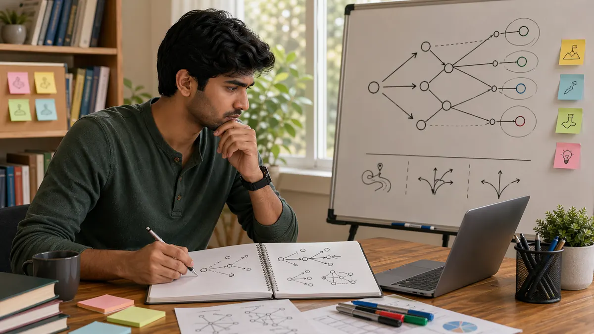

# Skill Gaming Strategic Thinking: How to Plan Beyond the Current Move

## 🪶 Introduction

Skill gaming strategic thinking matters because short-term decisions often look fine until you review what they created two steps later. Players who improve steadily usually get better at seeing not only the current choice, but also the shape of the next phase.

This guide explains strategic thinking in a practical way: why it matters, how planning really works in live play, why players confuse strategy with rigid prediction, and how to review whether your long-term idea actually matched the situation.

---

## 🖼️ Strategic Thinking Overview

---

## 🎯 What Is Strategic Thinking?

Strategic thinking is the habit of judging a move by what it sets up, what it weakens, and how it affects your future options. It is not about predicting everything perfectly. It is about staying aware of the bigger direction instead of making each decision in isolation.

Strategic thinking matters because many errors are not immediately visible. They become obvious only when the next turn arrives and the position is suddenly harder to handle.

---

# 🧠 1. Strategy Starts With a Clear Aim

The first step in strategic thinking is knowing what you are trying to achieve in the current phase. Are you protecting stability, building pressure, recovering control, or creating flexibility? Without that, even reasonable moves can pull in different directions.

In real sessions, vague aims often create mixed play. The player half-pressures and half-protects, which usually means neither plan is executed well.

# 🧠 2. Good Strategic Thinking Looks Only a Few Steps Ahead

Players sometimes imagine strategy as deep forecasting. In practice, useful strategic thinking is often modest. Looking one or two steps ahead is enough to catch many future problems and opportunities.

That shorter horizon is practical because it survives real pressure. If your strategy depends on perfect long-range prediction, it will usually fail once the table becomes dynamic.

# 🧠 3. Every Plan Has a Trade-Off

A plan that pushes pressure may reduce safety. A plan that preserves flexibility may give up immediate value. Strategic thinking improves when players say these trade-offs out loud instead of pretending the chosen line has no downside.

This matters because hidden trade-offs often become surprise problems later. If you knew the cost from the start, the plan is easier to review honestly.

# 🧠 4. Strong Strategy Leaves Room to Update

A useful plan is not a promise. It is a direction that should still respond to new information. Players get into trouble when they become loyal to the plan instead of loyal to the changing situation.

In review notes, this often appears as stubbornness. The player can explain why the original plan made sense, but not why they kept following it after the conditions changed.

# 🧠 5. Strategic Thinking Uses the Opponent's Likely Goal

Your plan becomes stronger when you ask what the other side is likely trying to do. That question reveals conflicts, timing windows, and ways to interfere before the situation becomes expensive.

Many players think strategically only from their own side. That narrows the picture and makes their plans easier to disrupt.

# 🧠 6. Misreads Often Come From Planning Too Early

One subtle mistake is deciding the whole story too soon. A player sees an opening, builds a plan around it, and then starts filtering later information through that early plan. The strategy becomes rigid before the position has fully developed.

The correction is simple but important: plans should harden slowly. Early reads deserve lighter commitment.

# 🧠 7. Better Strategy Shows Up in Cleaner Reviews

Strategic players can usually explain not only what they did, but what they expected the move to create. That makes review sharper. If the plan failed, you can ask whether the issue was the goal, the read, the timing, or the execution.

Without that layer, review becomes shallow because you are only judging the final move, not the structure behind it.

# 🧠 8. Strategy Becomes Strong Through Repeatability

The best strategic lines are not the ones that create the most memorable story. They are the ones you would still choose across many sessions because the logic stays sound. Repeatability is a powerful test because it removes the temptation to overvalue flashy outcomes.

If a strategy only looks good when everything goes right, it may not be a strategy at all.

This page connects especially well with [Skill Gaming Decision Making](./decision-making.md) for move quality and [Skill Gaming Advanced Concepts](./advanced-concepts.md) for higher-level adjustments once the planning habit is already stable.

---

## ⚠️ Common Mistakes

- Making each decision separately without a clear aim for the phase.
- Planning too far ahead and losing touch with current information.
- Ignoring the trade-off that comes with the chosen line.
- Refusing to update a plan after the position changes.
- Thinking strategically only from your own side of the table.

---

## ❓ FAQ

### Do I need to think many turns ahead to be strategic?

No. One or two steps ahead, done consistently, is often much more useful than a long prediction that breaks under pressure.

### What is the easiest way to improve strategic thinking?

Name the current aim of the phase before making an important decision, then review whether your move actually served that aim.

### Why do my plans fall apart so quickly?

Often because they were too rigid or because they were built before enough information was available.

### How can I review strategy after a session?

Ask what you expected the move to create, what actually changed, and whether the plan should have been updated earlier.

---

## 🧾 Summary

Skill gaming strategic thinking helps players protect future options instead of judging everything by the current move alone. The strongest takeaway is to plan with a clear aim, respect trade-offs, and stay willing to update the plan as soon as the position stops matching the original story.

---

## 🔥 Key Terms

skill gaming strategic thinking
planning ahead in games
long term decision making in games
strategic review for games
how to think more strategically

---

## Further Reading

- [Related gameplay notes](https://market-lab-cmd.github.io/india-skill-gaming-hub/)

---

## Related Pages

- [Skill Gaming Decision Making](./decision-making.md)
- [Skill Gaming Game Awareness](./game-awareness.md)
- [Skill Gaming Risk Balance](./risk-balance.md)
- [Skill Gaming Advanced Concepts](./advanced-concepts.md)
